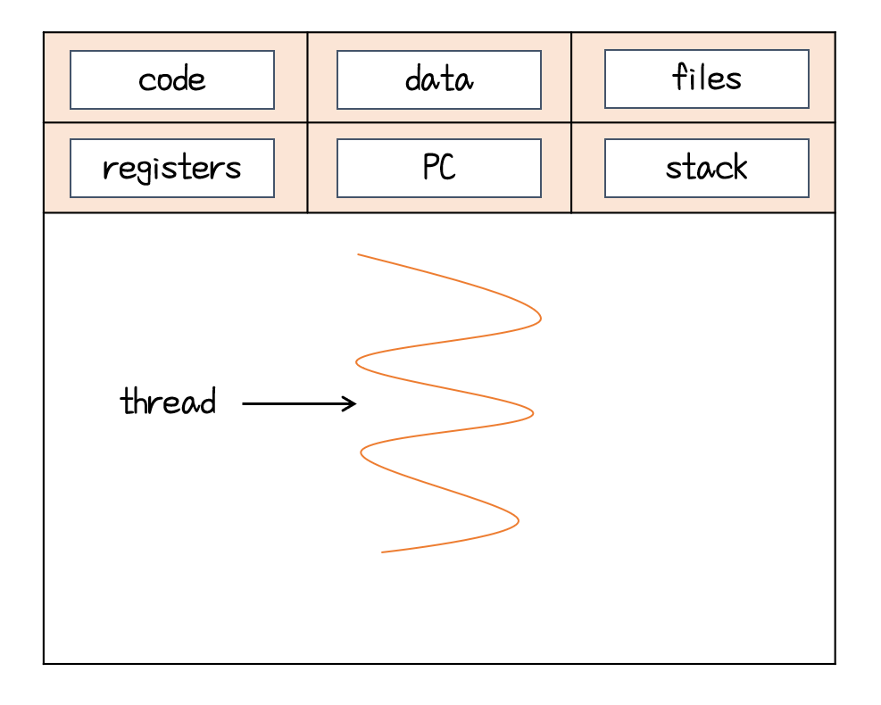

# 쓰레드

- `쓰레드(Thread)` : 프로세스 내에서 실행되는 흐름의 단위, CPU 스케줄링의 단위

   

- 쓰레드는 각자 자신의 스택, 레지스터, PC(Program Counter)를 보유

- 프로그램 내에서 Code, data, files, heap 등 영역을 공유

- 쓰레드를 생성하고 switching하는 것을 비싸지 않음

## 쓰레드 vs 프로세스

- 프로세스는 각자 프로세스간 통신에 IPC가 필요하지만 쓰레드는 필요없음
- 쓰레드는 code, data, heap, stack영역을 각자 보유하지만 쓰레드는 code, data, heap 영역은 공유하고 stack영역만 각자 보유
- 프로세스는 생성과 문맥교환에 비용이 많이 들지만 쓰레드는 적은 비용이 듦.

## 멀티 프로세스

- 운영체제에서 하나의 응용프로그램에 대해 동시에 여러 개의 프로세스를 실행 할 수 있게 하는 기

- 장점
  - 프로그램의 안전성 : 각 프로세스가 독립적인 메모리 공간을 가지고 있으므로, 한 프로세스가 비정상적으로 종료되어도 다른 프로세스에 영향 :x:
  - 프로그램 병렬성 : 다중 CPU 시스템에서 각 프로세스를 병렬적으로 실행하여 성능을 향상 시킬 수 있음
  - 시스템 확장성 : 각 프로세스가 독립적새로운 기능이나 모듈을 추가하거나 수정할떄 다른 프로세스에 영향을 주지 않으므로 시스템의 규모를 쉽게 확장 가
- 단점
  - 스위칭 과정에서 성능의 저하
  - 자원 공유 비효율성 : 독립적인 메모리 공간 :arrow_right: 메모리 사용량이 증

## 멀티 쓰레드

+ 하나의 프로세스 안에 여러 개의 쓰레드가 있는 것을 말함. 하나의 프로그램에서 두 가지 이상의 동작을 처리하도록 하는 행위 가능
+ 장점 
  + 프로세스보다 가벼움
  + 자원의 효율성 :  IPC을 사용하지 않고도 데이터를 공유할 수 있어서 효율적으로 자원을 활용이 가능해 시스템 자원 소모가 줄어듦
  + 문맥 교환 비용 감소
  + 응답 시간 단축
+ 단점
  + 안정성 문제 : 쓰레드에서 문제가 발생하면 다른 쓰레드들도 영향을 받아 전체 프로그램이 종료될 수도 있음 :arrow_right: 프로그래머의 역량에 따라 극복 가능(예외 처리, 쓰레드 풀)
  + 동기화로 인한 성능 저하 
  + 데드락(교착 상태)
  + 디버깅이 어려움
  + 운영체제의 지원이 필요

## 멀티 프로세스 vs 멀티 쓰레드

`멀티 프로세싱`은 여러 개의 프로세스가 각자 하나의 작업을 맡아 처리하는 것

`멀티 쓰레딩`은 여러 개의 쓰레드가 하나의 작업을 처리하는 것

