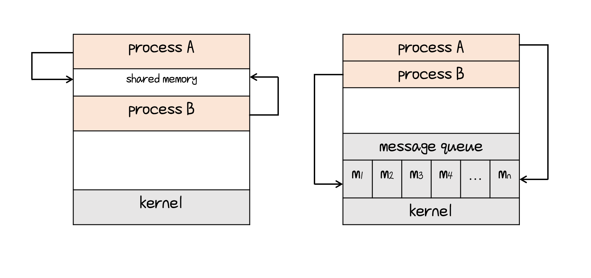

# IPC (Inter - Process Communication)

- `IPC(프로세스 간 통신)` : 프로세스 간에 서로 데이터를 주고받는 행위 또는 그에 대한 방법이나 경로.

- IPC의 두 가지 기본 모델

  - shared memory(공유 메모리)
  - message passing

  


## Shared-Memory System

- 소비자 & 생산자 문제 : 생산자는 소비자가 소비할 정보를 생산함

  - 컴파일러는 어셈블리 코드를 생산 :arrow_right: 어셈블러(assembler)는 그 코드를 소비
  - 웹 서버는 HTML 파일을 생산 :arrow_right: 브라우저(browser)는 그 파일을 소비

- 소비자와 생산자가 동시에 실행할 수 있게함

  

- 생산자가 정보를 채워 넣고 소비자가 소모할 수 있는 공유 아이템들을 위한 버퍼(buffer)가 반드시 존재 해야함

- buffer가 비워져있는 상태 :arrow_right: Q : wait

- buffer가 가득 차 있는 상태 :arrow_right: P : wait

- 공유 메모리 정의하기

  ````c
  # define BUFFER_SIZE 10
  
  typedef struct{
      . . .
  } item;
  
  item buffer[BUFFER_SIZE];
  int in = 0;
  int out = 0;
  ````

  

- 생산자

  ```c
  item next_produced;
  
  while(true){
      /*produce an item in next_produced*/
      
      while (((in + 1) % BUFFER_SIZE) == out)
  		; /*do nothing*/
      buffer[in] = next_produced;
      in = (in + 1) % BUFFER_SIZE;
  }
  ```
  
- 소비자

  ```c
  item next_consumed;
  
  while (true){
      while(in == out)
          ; /*do nothing*/
      next_consumed = buffer[out];
      out = (out + 1) % BUFFER_SIZE;
      
      /*consume the item in next_consumed*/
  
  ```


## Message-Passing System

- O/S(운영체제)가  메시지 전달 기능을 통해 프로세스가 상호 소통할 수 있도록 협력하는 수단을 제공

- 두 가지 방식

  - send(message)

    ```c
    message next_produced;
    
    while(true){
    	/*produce an item in next_produced*/
        send(next_produced);
    }
    ```

  - receive(message)

    ```c
    message next_consumed;
    
    while(true){
        receive(next_consumed);
        /*consume the item in next_consumed*/
    }
    ```

- 프로세스 간 통신을 위해서 두 프로세스 사이에 먼저 `communication link (통신 연결)` 설정되어야 함.

### `communication link(통신 연결)` 구현 방법

- **direct** or  **indirect** comunication
- **synchronous** and **asynchronous** communication
- automatic of explicit buffering


**direct communication**

- send와 receive가 각각의 프로 세스 이름을 가지고 있음
- send(P, message) , receive(Q, message)
- symmetry(대칭구조)
- 통신을 원하는 프로세스 사이에 연결이 <u>자동적</u>으로 구축
- 문제 :arrow_right: 상대방의 이름이 달라지면 문제가 생김


**indirect communication**

- 메세지는 Mailbox 또는 ports로 송신되고 그것을 수신하는 구조
- send(A, message), receive(A, message) // mailbox A
- 메일 박스는 하나의 장소로 프로세스에 의해 메세지가 들어가거나 나오는 공간
- 통신을 원하는 프로세스 간에 공유 메일 박스를 가져야함
- link는 두 개이상의 프로세스와 연결될 수 있음


**Synchronization**

- blocking :arrow_right: Synchronous(동기식)
- non-blocking :arrow_right: Asynchronous(비동기식)
  1. Blocking send : 발송자(sender)는 수신자(receiver)가 다 받을 때까지 blocked
  2. Non-blocking send : 발송자는 수신자가 메세지를 받든 말든 계속함
  3. Blocking receive : 수신자는 메세지가 올 때까지 기다림
  4. Non-blocking receive : 발송자가 메시지를 보내지 않아도 상관하지 않음. 유효한 메세지 혹은 null 코드를 내보내기 때문에 어떤 코드가 나왔는지 보고 판단


