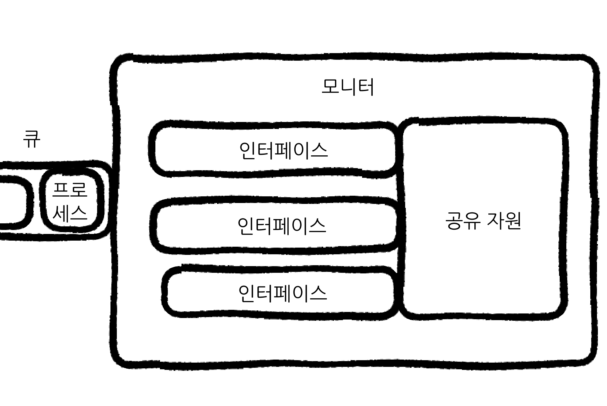
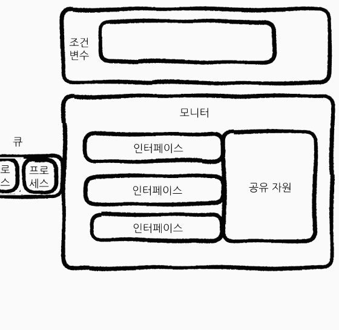

> 다른 프로세스들과 영향을 주고 받는 **협력적 프로세스**는 **데이터의 일관성**을 유지하기 위해 서로 **동기화**가 될 필요가 있다.
> 

*다음 협력적 프로세스들를 살펴보자.*

### **생산자 - 소비자 문제**

**생산자(Producer)**

```c
while(true){
	/* 생산 */
	while (counter == BUFFER_SIZE);
	/* do noting */
	buffer[in] = next_produced;
	in = (in + 1) % BUFFER_SIZE;
	counter ++
}
	
```

**소비자(Consumer)**

```c
while(true) {
	while(counter == 0);
	/* do noting */
	next_consumed = buffer[out];
	counter --;
	/* 소비 */
}
```

자원을 만들기만 하는 **생산자**와 자원을 사용하기만 하는 **소비자**가 존재한다. 

두 프로세스가 사용하는 *버퍼는 수치적으로 보았을 때 counter 라는 변수*에 의존한다.

그러나 두 프로세스가 병렬적으로 수행될 때 **저수준 언어**에서는 counter+- 가 한 줄로만 실행되지 않는다. 레지스터에 값을 저장하려면 레지스터를 불러오고, 값을 변경하고, 다시 집어넣는 방식으로 변환될 수 있다.

```c
exsample

counter++
->
register = counter
register = register + 1
counter = register1
```

*이렇게 세 단계로 구분되기 때문에 섞인다면 결과가 완전히 뒤바껴버릴 수 있다.*

---

> **Race condition(경쟁 상황)** : 실행 결과가 **접근이 발생한 특정 순서**에 의존하는 상황
> 

*이와 같은 상황을 막기 위해 **한 순간에 하나의 프로세스**만이 count에 접근할 수 있도록 해야 한다. 그러기 위해선 두 프로세스는 동기화가 되어야 한다.*

> 동기화 - ‘작업들 사이의 수행 시기를 맞추는 것’ **프로세스 동기화**란 아래의 두 가지를 의미한다.
> 
- **실행 순서 제어:** 프로세스를 올바른 순서대로 실행하기
- **상호 배제:** 동시에 접근해서는 안 되는 자원에 하나의 프로세스만 접근하게 하기.

---

### **임계구역(critical section)**

프로세스에는 **임계구역**이라는 코드부분이 있다. 이 부분은 여러 프로세스들이 정보를 수정할 수 있는 공간이라 **한 프로세스가 들어가면 다른 프로세스가 접근할 수 없게끔** 상호배제가 이루어져야 한다.

*상호배제가 이루어지려면 진입할 때 진입 허가를 요청해야 한다.*

**진입 구역(entry section)**: 진입 요청을 구현하는 코드 부분

**퇴출 구역(exit section):** 임계구역 뒤의 부분

**나머지 구역(remainder section):** 나머지 일반적인 부분

```c
while (true) {

/* -- 진입 구역 -- */

(임계 구역)

/* -- 퇴출 구역 -- */

(나머지 구역)
```

*상호배제 동기화를 통해 임계구역을 설정하려면 다음과 같은 원칙이 지켜져야 한다.*

1. **상호 배제(mutual exclusion):** 한 프로세스가 임계구역에서 실행되는 동안, 다른 프로세스는 자신의 임계구역에서 실행될 수 없다.
2. **진행(progress):** 임계구역에서 실행되는 프로세스가 없고, 진입하려고 하는 프로세스가 있다면 누가 임계구역으로 진입할 수 있을지 결정할 수 있으며 이 선택은 연기될 수 있다.
3. **한정된 대기(bounded waiting):** 프로세스가 임계구역에 진입하고 싶어한다면 그 프로세스는 언젠가 들어올 수 있어야 한다. (계속 대기하고 있으면 안된다.)

---

## 동기화 예시

### [1] Peterson의 해결안

- 고전적인 소프트웨어-기반 해결책
- 이 해결안은 **두 개의 프로세스가 있을 때**로 조건이 한정된다.

**[초기 조건]**

- 두 프로세스는 아래의 변수들를 공유한다.

```c
int turn 
// 누가 임계 구역에 들어갈 턴인지를 결정
Boolean flag[2]
// (array) 임계구역에 들어갈 준비가 되었는지(들어가고 싶은지)
// 를 나타낸다.
```

[임계 구역에 진입하는 방법]

1. flag[i] 를 true 로 만든다.
2. turn을 j로 바꾼다.

[코드]

```c
while(true){
flag[i] = true;
turn = j;
while (flag[j] && turn == j);
	/* critical section */
flag[i] = false;
	/* remainder section */
}
```

```c
while (flag[j] && turn == j);
```

둘 중 하나가 **False가 되었을 때 while 문을 빠져나오게 된다.**

j도 같은 코드를 가지고 있다. *(flag와 turn 지정만 다른)*

하지만 만약 j와 i가 동시에 실행되었다고 하더라도 **turn의 값은 하나이기 때문에 while 문을 통과할 프로세스는 하나 뿐이다.**

(예시)

```c
/* start */

[i] -> flag[i] = true
[j] -> flag[j] = true
[i] -> turn = j
[j] -> turn = i

/* status flag[i,j] = true / turn = i */

[i] 진입요청
flag[j] = true && turn != j
while -> false
/* critical section */

[j] 진입요청
flag[i] = true && turn == i
while -> true
/* wait */

[i] 가 나온 뒤
flag[i] = false; 를 실행하기 때문에
[j]의 while 문이 풀리게 되어 실행 가능하다.
```

*그러나 위 해결안은 소프트웨어 기반이고, 오래 전에 이야기 되었기 때문에 최신 컴퓨터 아키텍쳐에선 작용하지 않을 수 있다.*

### **[2] 메모리 장벽**

메모리 모델: 컴퓨터 아키텍처가 응용 프로그램에게 제공하는 메모리 접근 시 보장되는 사항을 결정한 방식.

**1) 강한 순서:** 한 프로세서의 메모리 변경 결과가 다른 모든 프로세서에 즉시 보임.

**2) 약한 순서:** 한 프로세서의 메모리 변경 결과가 다른 프로세서에 즉시 보이지 않음.

이 유형은 프로세스마다 다르다. 다른 프로세서들에게 보이지 않으면 메모리 변경 결과를 알 수 없기 때문에 컴퓨터 아키텍쳐는 메모리의 모든 **변경 사항을 다른 모든 프로세서로 전파하는 명령어를 제공한다. (메모리 장벽 memory barriers)**

> 메모리 장벽: 명령어가 저수준 언어 레벨에서 재정렬되더라도 메모리 장벽은 항후 적재 또는 저장 작업이 수행되기 전에 저장 작업이 메모리에서 완료되어 다른 프로세서들에게 보이도록 한다.
> 

```c
T1

while (! flag)
	memory_barrier();
print x;

```

```c
T2

x = 100;
memory_barrier();
flag = true;
```

***flag 값이 x보다 먼저 적재되도록 보장한다.*** 

---

## [3] 하드웨어 명령어

> 여러 줄의 명령어들을 **atomic(원자적)으로 만들면 저수준 언어에서도 쪼개지지 않는다.** 수행 도중에 인터럽트 당하지 않는다는 뜻이다. 프로세스가 실행이 되거나/되지 않거나 가 완전히 보장된다.
> 

### **[3-1] TAS 방식 (test_and_set)**

**[초기 조건]**

test_and_set 함수

```c
boolean test_and_set (boolean *target)
{
	boolean rv = *target;
	*target = TRUE;
	return rv;
}
```

***이 명령어는 원자적으로 실행된다. (This instruction is executend stomically)***

프로세스들은 다음의 변수를 공유한다.

```c
boolean lock; // initialized False
```

(실행 코드)

```c
do{
	while(test_and_set(&lock));
	/* do nothing */

	/* critical section */

	lock = false;

	/* remainder section */
} while (true);
```

**test_and_set 함수가 거짓**이 되면 while문을 빠져나온다.

**처음 lock에 들어간 false은 false를 반환**함으로서 **while문을 나오지만** lock의 값은 true로 바뀌게 된다. 때문에 **다음 번에 이 while문을 통과하려는 프로세스는 나올 수 없다.**

*초기값이 false인 lock값을 원자적으로 true로 만듬으로서 상호 배제를 구현하는 것이다.*

---

### [3-2] CAS 방식 (compare_and_swap)

**[초기 조건]**

compare_and_swap 함수

```c
int compare_and_swap(int *value, int expected, int new_value)
{
	int temp = *value;
	if (*value == expected)
		*value = new_value;
	return temp;
"
```

***이 명령어는 원자적으로 실행된다. (This instruction is executend stomically)***

다음의 변수를 공유한다

```c
Boolean lock; // initalized to 0;
```

(실행)

```c
while (true){
	while (compare_and_swap(&lock, 0, 1) != 0);
		/* do nothing */

		/* critical section */

		lock = 0;
		
		/* remainder section */

}
```

**expected = 0**

**new_value= 1**

피연산자 value는 오직 **(*value == expected)** 이 **참일 때에만 new_value**로 지정된다.

즉, **예측한 값이 참일 때만 새 값으로 바뀌게 된다.**

---

### [4] Mutex Locks (뮤텍스 락) (spinlock)

하드웨어 기반 해결책은 응용 소프트웨어 프로그래머들이 사용할 수 없다. 대신 **mutex 락**이라는 상위 수준 도구를 사용한다.

> 프로세스는 임계구역에 들어가기 전에 반드시 락을 획득해야 하고, 빠져나올 때 반환해야 한다.
> 

**[초기 조건]**

***아래의 두 함수는 반드시 원자적(atomic) 이여야 한다.***

**acquire():** 락을 획득한다.

```c
acquire(){
	while (!available);
	/* busy wait */
	available = false;
}
```

**release():** 락을 반환한다.

```c
release() {
	acailable = true;
}
```

(사용)

```c
while (true) {
	/* -- acquire lock -- */
		critical section
	/* -- release lock --*/
		remainder section
```

여기까지의 구현 방식은 **바쁜 대기busy waiting** 가 필요하다.

> **바쁜 대기**: 기다리기 위해 loop문을 CPU가 계속 체크한다. CPU의 자원 낭비가 된다.
> 

---

### [4] 세마포(Semaphores)

> 바쁜 대기 문제를 해결하기 위해 **일시적으로 휴면 상태**로 전환한 후 락을 사용할 수 있게 되면 깨워 바쁜 대기를 피한다.
> 

**세마포 S는 정수 변수**로 **wait()와 signal()** 함수만이 접근할 수 있다.

***(두 함수는 원자적이여야 한다.)***

**[초기 조건]**

wait()

```c
wait(S){
	while (S <= 0);
	S--;
}
```

signal()

```c
signal(S){
	S++;
}
```

세마포 사용법

- **이진 세마포**: 값의 범위, **0과 1사이의 값만 가능**.

*(mutex 락과 유사하게 동작)*

- **counting 세마포**: 값의 범위, **제한 없다.**

**(유한한 개수**를 가진 자원에 대한 접근 제어. *세마포는 사용 가능한 자원의 개수로 초기화*된다.)

1. 임계 구역에 접근하려는 프로세스는 **세마포에 wait() 연산을 수행**한다.
2. (1) 로 인해 **세마포의 값이 감소**한다.
3. 임계 구역에서 나왔을 때, **signal() 연산을 수행**한다.
4. (3) 로 인해 **세마포는 증가**한다.
5. **세마포의 값이 0이 되면 모든 자원이 사용 중임을 뜻한다.**

(실행)

- P1과 P2가 병렬적으로 진행하고 있다. P1이 먼저 수행되고 P2가 이후에 수행되어야 한다고 가정하자.
- 두 프로세스는 세마포 synch를 공유한다. 이를 0으로 초기화한다.

```c
P1

S1;
signal(S);
```

```c
P2

wait(S);
S2;
```

---

하지만 위의 방식으로도 바쁜 대기를 막을 순 없다.

세마포를 다음과 같이 구현하면 바쁜 대기를 막을 수 있다.

세마포 S

```c
typedef struct{
	int value;
	struct process *list;
} semaphore;
```

wait()

```c
wait(semaphore *S){
	S-> value--;
	if (S -> value < 0) {
		add this process to S->list;
		sleep();
	}
}
```

**세마포 값이 양수가 아닌 것**을 발견하면, **프로세스는 반드시 대기**한다. **바쁜 대기 대신 프로세스는 잠시 중단된다.(sleep)**

signal()

```c
signal(semaphore *S){
	S -> value++;
	if (S-> value <= 0) {
		remove a process P from S-> list;
		wakeup(P);
	}
}
```

**다른 프로세스가 signal() 연산**을 실행하면 **다시 시작된다. (wakeup)**

**프로세스 리스트에 있는 리스트 중 하나를 꺼낸다.**

---

### [5] 모니터monitor

세마포를 사용해도 시간-순서 적 오류가 생길 수 있다.

또한 함수를 설정해야 하기 때문에 번거롭기도 하다.

> **모니터**는 공유 자원과 공유 자원에 접근하기 위한 인터페이스를 묶어 관리한다. 프로세스는 반드시 **인터페이스를 통해서만 공유 자원에 접근 가능**하다.
> 



> **조건 변수: 특정 조건**을 바탕으로 **프로세스를 실행하고 일시 중단**하기 위해 사용. **실행 순서를 제어하는 특별한 변수.**
> 

**wait:** 호출한 프로세스의 상태를 대기로 전환하고 일시적으로 조건 변수에 대한 *대기 큐*에 삽입하는 연산. (위 그림의 큐와는 다르다)

(조건 변수의 동작)



**signal:** wait 연산으로 일시 중지된 프로세스를 재개하는 연산. 이 호출을 통해 대기 상태에 있던 프로세스가 깨어나 모니터 안으로 다시 돌아온다.

---

---
